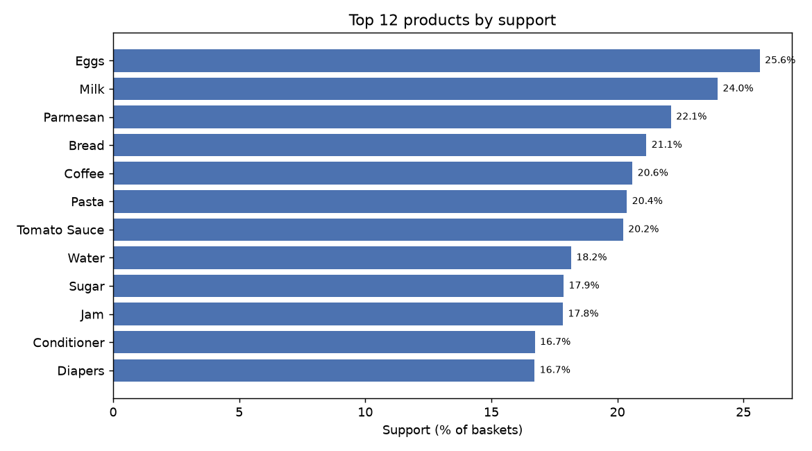
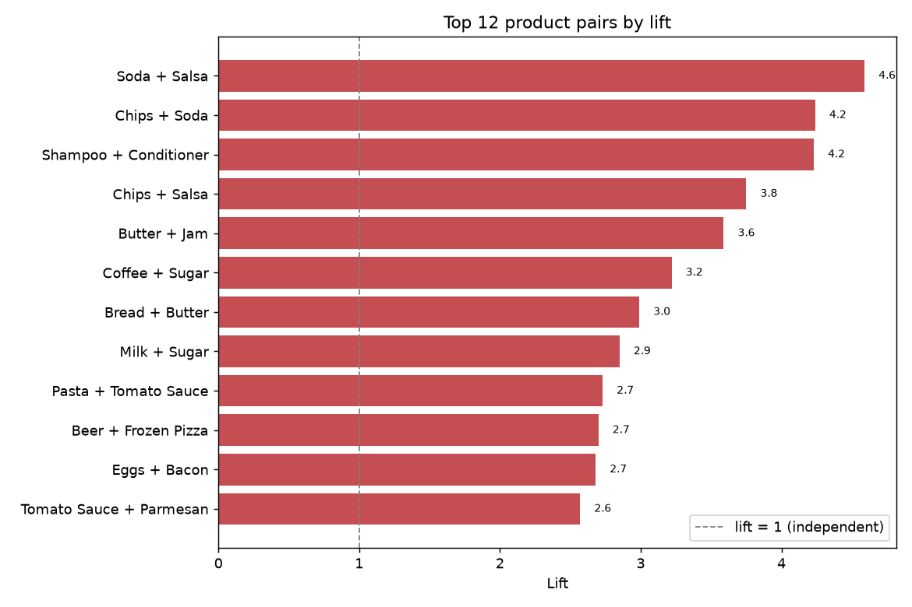
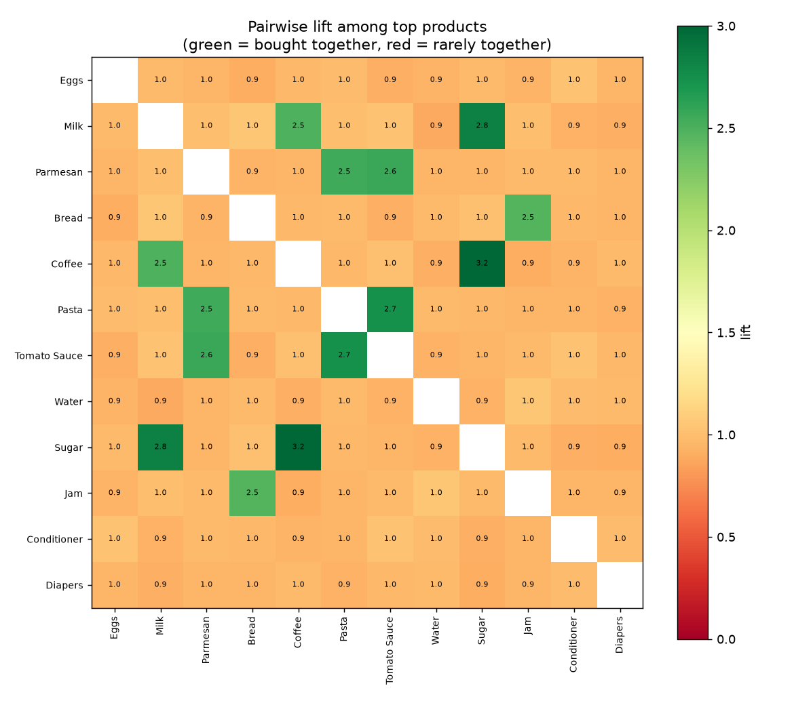

# Market basket analysis — report

_Generated by `src/analyze.py` against PostgreSQL. Numbers are reproducible (fixed random seed)._

## Executive summary

| Metric | Value |
|---|---:|
| Transactions (baskets) | 12,000 |
| Products | 35 |
| Avg basket size | 4.74 |
| Pairs above min-support | 576 |
| Strongest pair (lift) | Soda + Salsa (4.6×) |

## Top products by support

## Strongest associations (lift)

| Item A | Item B | Baskets | Support | conf A→B | conf B→A | Lift |
|---|---|---:|---:|---:|---:|---:|
| Soda | Salsa | 1,054 | 8.78% | 67.3% | 59.9% | 4.59 |
| Chips | Soda | 1,068 | 8.90% | 55.4% | 68.2% | 4.24 |
| Shampoo | Conditioner | 773 | 6.44% | 70.7% | 38.5% | 4.23 |
| Chips | Salsa | 1,060 | 8.83% | 55.0% | 60.2% | 3.75 |
| Butter | Jam | 1,021 | 8.51% | 64.0% | 47.7% | 3.59 |
| Coffee | Sugar | 1,420 | 11.83% | 57.4% | 66.2% | 3.22 |
| Bread | Butter | 1,010 | 8.42% | 39.8% | 63.3% | 2.99 |
| Milk | Sugar | 1,463 | 12.19% | 50.9% | 68.2% | 2.85 |
| Pasta | Tomato Sauce | 1,353 | 11.28% | 55.3% | 55.7% | 2.73 |
| Beer | Frozen Pizza | 464 | 3.87% | 26.9% | 38.7% | 2.70 |
| Eggs | Bacon | 1,169 | 9.74% | 38.0% | 68.7% | 2.68 |
| Tomato Sauce | Parmesan | 1,379 | 11.49% | 56.8% | 51.9% | 2.57 |

## Lift heatmap

## Best cross-sell rule per product

"Customers who buy **A** are most likely to also buy **B**."

| If basket has | Recommend | Confidence | Lift |
|---|---|---:|---:|
| Shampoo | Conditioner | 70.7% | 4.23 |
| Bacon | Eggs | 68.7% | 2.68 |
| Soda | Chips | 68.2% | 4.24 |
| Sugar | Milk | 68.2% | 2.85 |
| Butter | Jam | 64.0% | 3.59 |
| Salsa | Chips | 60.2% | 3.75 |
| Coffee | Milk | 59.6% | 2.49 |
| Tomato Sauce | Parmesan | 56.8% | 2.57 |
| Pasta | Parmesan | 56.4% | 2.55 |
| Chips | Soda | 55.4% | 4.24 |
| Jam | Bread | 52.1% | 2.46 |
| Parmesan | Pasta | 51.9% | 2.55 |

## Findings & recommendations

1. **The analysis recovers real complement bundles.** The top pairs by lift (Soda+Salsa at 4.6×, and the others in the table) are bought together far more than chance — these are genuine complements, not coincidence.
2. **High lift ≠ high volume.** Some high-lift pairs have modest support; lift finds the *relationship*, support tells you how *often* it matters. Act on pairs that score on both.
3. **Cross-sell / placement.** Use the per-product rule table to drive 'frequently bought together' widgets and shelf placement; co-locating complements lifts attach rate.
4. **Promo design.** Discount one item in a high-lift pair and expect pull-through on its complement; never discount both at once.
